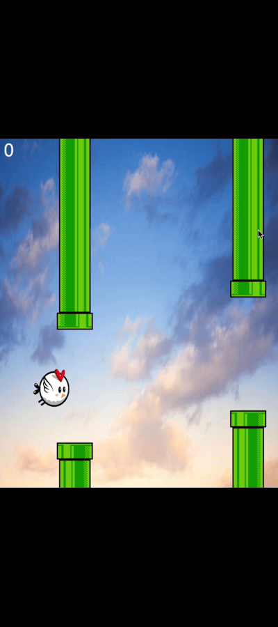

# 🐦 **Sky Glide** – A Flappy Bird-Inspired Game

Welcome to **Sky Glide** – a fun, fast-paced game where you guide a bird through an endless series of obstacles. Tap to make the bird flap and soar through the skies, avoiding pipes and earning points!

## 🎮 **Gameplay**

In **Sky Glide**, your goal is simple: flap through as many gaps between pipes as possible. Every successful pass through a set of pipes increases your score. But be careful – colliding with the pipes or falling to the ground will end the game!

### Key Features:
- **Smooth Bird Animation:** The bird’s flapping wings are animated using a sequence of 4 images, giving it a lively, dynamic feel.
- **Background Music & Sound Effects:** Enjoy a continuous background soundtrack while playing, and experience explosive sound effects on collisions.
- **Simple Controls:** Use the spacebar to make the bird flap. The game automatically restarts after a game over with another tap of the spacebar.
- **Score Display:** Keep track of your high score as you progress through the game.

## 📦 **Installation**

To play **Sky Glide**, follow these simple steps:

1. **Clone the repository:**
    ```bash
    git clone https://github.com/Jason-Ampere/Sky-Glide.git
    cd sky-Glide
    ```

2. **Compile and Run the Game:**
    - Make sure you have Java Development Kit (JDK) installed.
    - Compile the game using your preferred IDE or command line:
      ```bash
      javac App.java
      java App
      ```

3. **Enjoy the game!**

## 🚀 **How to Play**

- **Flap:** Press the `Spacebar` to make the bird flap and move upwards.
- **Navigate:** Avoid hitting the pipes by flapping carefully through the gaps.
- **Game Over:** When the bird collides with a pipe or falls out of the sky, the game ends. Press `Spacebar` again to restart.
- **Score:** You earn points by successfully passing through the pipes.

## 🎨 **Assets**

The game uses the following assets:
- **Bird Animation:** A set of 4 images for the bird’s flapping animation.
- **Background, Pipes, and Game Objects:** Custom pixel art images.
- **Sound Effects:** Background music and explosion sound effects are added for an immersive experience.

## 🛠️ **Features & Future Enhancements**

- **Current Features:**
  - Flapping bird animation.
  - Scrolling pipes.
  - Background music and collision sound effects.
  
- **Planned Enhancements:**
  - Add difficulty levels.
  - Implement a leaderboard system.
  - Introduce different bird skins.
  - Mobile-friendly controls and UI improvements.

## 🖼️ **Screenshots**

 <!-- Add your screenshot here -->

*The bird soaring through the pipes!*

## 🤝 **Contributing**

Contributions are welcome! If you have ideas to improve the game or find bugs, feel free to:
1. Fork this repository.
2. Create a new branch: `git checkout -b feature/your-feature`.
3. Commit your changes: `git commit -m 'Add some feature'`.
4. Push to the branch: `git push origin feature/your-feature`.
5. Submit a pull request!


Enjoy playing **Sky Glide** and feel free to share your high scores with us!
